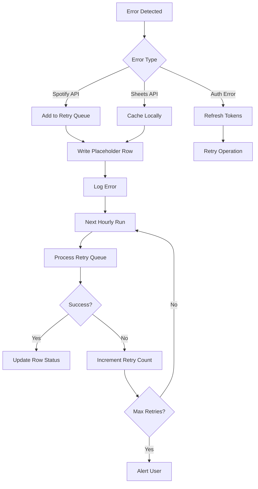

# Spotify Song Logger to Google Sheets - Specification

## Overview
An automated system that logs every Spotify song play (30+ seconds) to a Google Sheet, running hourly on a cloud platform, with comprehensive metadata capture and error handling.

## Table of Contents
1. [Core Requirements](#core-requirements)
2. [Architecture](#architecture)
3. [API Integrations](#api-integrations)
4. [Implementation Phases](#implementation-phases)
5. [Success Criteria](#success-criteria)

## Core Requirements

### Data Collection

**Spotify API Data Points to Capture:**

#### Song Information
- Track name
- Track ID
- Track URI
- Duration (milliseconds)
- Popularity score (0-100)
- Explicit content flag
- ISRC (International Standard Recording Code)

#### Artist Information
- Artist name(s) - comma-separated for multiple artists
- Artist ID(s)
- Artist genres
- Artist popularity

#### Album Information
- Album name
- Album ID
- Album URI
- Release date
- Album type (album/single/compilation)
- Total tracks in album
- Album art URL

#### Playback Context
- Timestamp when played (ISO 8601 format)
- Device name
- Device type (computer/smartphone/speaker)
- Playing context type (playlist/album/artist/collection)
- Context URI (playlist/album URI if applicable)
- Shuffle state (on/off)
- Repeat state (off/track/context)

#### Audio Features
- Tempo (BPM)
- Energy (0-1)
- Danceability (0-1)
- Valence/positivity (0-1)
- Acousticness (0-1)
- Instrumentalness (0-1)
- Speechiness (0-1)
- Loudness (dB)
- Key (0-11)
- Mode (major/minor)
- Time signature

#### User Interaction Data
- Progress when logged (milliseconds)
- Estimated completion percentage
- Skip indicator (if track was skipped)
- Source of play (user initiated vs autoplay)

### Logging Rules

- **Minimum Play Duration**: 30 seconds required for logging
- **Check Frequency**: Every hour via scheduled cloud function
- **Duplicate Handling**: Log all plays including repeats (each play gets new row)
- **Detection Method**: Compare current playing track with last logged entry using:
  - Track ID
  - Timestamp difference > 30 seconds
  - Progress position
- **Edge Cases**:
  - Paused songs: Only log if resumed and total play time > 30 seconds
  - Scrubbing: Use cumulative play time, not just position
  - Offline plays: Capture when device comes back online

### Google Sheets Structure

#### Main Sheet: "Listening Log"

| Column | Type | Description |
|--------|------|-------------|
| Timestamp | DateTime | When the song was logged (ISO 8601) |
| Track Name | String | Song title |
| Artist(s) | String | Comma-separated artist names |
| Album | String | Album name |
| Duration (ms) | Integer | Total track duration in milliseconds |
| Play Duration (ms) | Integer | How long user listened |
| Completion % | Float | Percentage of song played |
| Track ID | String | Spotify track ID |
| Album ID | String | Spotify album ID |
| Artist ID(s) | String | Comma-separated Spotify artist IDs |
| Genres | String | Comma-separated genres |
| Tempo | Float | BPM |
| Energy | Float | 0-1 energy score |
| Danceability | Float | 0-1 danceability score |
| Valence | Float | 0-1 positivity score |
| Acousticness | Float | 0-1 acoustic score |
| Instrumentalness | Float | 0-1 instrumental score |
| Speechiness | Float | 0-1 speech presence |
| Loudness | Float | Average loudness in dB |
| Popularity | Integer | 0-100 popularity score |
| Device | String | Device name |
| Device Type | String | Device category |
| Context | String | Playlist/album/artist context |
| Context URI | String | Spotify URI of context |
| Explicit | Boolean | Explicit content flag |
| Release Date | Date | Album release date |
| Status | String | COMPLETED/PENDING/ERROR |
| Error Details | String | Error message if applicable |

#### Historical Import Sheet: "Historical Data"
- Same structure as main sheet
- Separate to distinguish from real-time logging
- Include import timestamp column

#### System Logs Sheet: "System Logs"

| Column | Type | Description |
|--------|------|-------------|
| Timestamp | DateTime | When the event occurred |
| Log Level | String | INFO/WARNING/ERROR |
| Event Type | String | Category of event |
| Details | String | Detailed message |
| Retry Count | Integer | Number of retry attempts |
| Resolution Time | DateTime | When issue was resolved |
| Affected Tracks | String | Track IDs affected |

## Architecture

### Deployment Options

#### Primary: Vercel Functions
- **Pros**: Free tier, easy deployment, built-in cron
- **Setup**: Deploy via Vercel CLI or GitHub integration
- **Cron**: Vercel Cron Jobs (hourly trigger)

#### Alternative: Google Cloud Functions
- **Pros**: Native Google integration, closer to Sheets API
- **Setup**: Deploy via gcloud CLI
- **Cron**: Cloud Scheduler

#### Development: Claude Code
- Local development and testing
- Manual triggers for debugging
- Prototype implementation

### System Components

#### 1. Main Logging Function (`/api/log-spotify`)
```javascript
// Runs every hour
// Flow:
1. Authenticate with Spotify
2. Fetch recently played tracks
3. Check current playing track
4. Filter for 30+ second plays
5. Compare with last logged entries
6. Write new entries to Google Sheets
7. Update state storage
8. Handle any errors
```

#### 2. Authentication Handler (`/api/auth-spotify`)
```javascript
// Manages OAuth tokens
// Flow:
1. Check token expiration
2. Refresh if needed
3. Store new tokens securely
4. Return valid access token
```

#### 3. Historical Import (`/api/import-history`)
```javascript
// One-time or manual trigger
// Flow:
1. Authenticate with Spotify
2. Fetch last 50 songs (API limit)
3. Get audio features for each
4. Write to Historical Data sheet
5. Mark import completion
```

#### 4. Error Recovery (`/api/retry-failed`)
```javascript
// Processes failed attempts
// Flow:
1. Read pending entries from queue
2. Retry Spotify API calls
3. Update Google Sheets rows
4. Clear successful retries from queue
```

### State Management

**Required State Storage** (Vercel KV/Redis/Upstash):

```javascript
{
  "lastProcessed": {
    "trackId": "spotify:track:xxx",
    "timestamp": "2024-01-01T12:00:00Z",
    "playedAt": "2024-01-01T11:59:00Z"
  },
  "failedQueue": [
    {
      "trackId": "spotify:track:xxx",
      "attemptCount": 2,
      "lastAttempt": "2024-01-01T12:00:00Z",
      "error": "Rate limit exceeded",
      "data": { /* partial track data */ }
    }
  ],
  "tokens": {
    "spotify": {
      "access": "xxx",
      "refresh": "xxx",
      "expiresAt": "2024-01-01T13:00:00Z"
    }
  },
  "stats": {
    "lastRun": "2024-01-01T12:00:00Z",
    "successCount": 1234,
    "failureCount": 5,
    "consecutiveFailures": 0
  }
}
```

### Error Handling Strategy

#### API Failure Scenarios

1. **Spotify API Errors**
   - Rate limiting → Exponential backoff
   - Auth failure → Refresh token
   - 5xx errors → Retry with backoff
   - Track not found → Log and skip

2. **Google Sheets API Errors**
   - Rate limiting → Batch operations
   - Auth failure → Refresh service account
   - Sheet full → Alert user
   - Network timeout → Retry queue

3. **State Storage Errors**
   - Connection failure → Local fallback
   - Data corruption → Rebuild from Sheets

#### Recovery Process



## API Integrations

### Spotify Web API

#### Required Endpoints
- `GET /v1/me/player/recently-played` - Recent listening history
- `GET /v1/me/player/currently-playing` - Current playback
- `GET /v1/audio-features/{id}` - Track audio features
- `GET /v1/tracks/{id}` - Track details
- `GET /v1/albums/{id}` - Album details
- `GET /v1/artists/{id}` - Artist details

#### OAuth Scopes Required
```
user-read-recently-played
user-read-currently-playing
user-read-playback-state
user-read-playback-position
user-library-read
```

#### Rate Limits
- Default: 180 requests per minute
- Strategy: Cache responses, batch requests

### Google Sheets API v4

#### Required Operations
- `spreadsheets.values.append` - Add new rows
- `spreadsheets.values.batchUpdate` - Update multiple cells
- `spreadsheets.values.get` - Read existing data
- `spreadsheets.batchUpdate` - Format sheets

#### Authentication
- Service Account with Editor role
- Domain-wide delegation not required
- Key rotation every 90 days recommended

#### Best Practices
- Batch writes (up to 1000 rows)
- Use `USER_ENTERED` value input option
- Implement exponential backoff
- Cache sheet metadata

### Environment Variables

```bash
# Spotify Configuration
SPOTIFY_CLIENT_ID=your_client_id
SPOTIFY_CLIENT_SECRET=your_client_secret
SPOTIFY_REFRESH_TOKEN=your_refresh_token
SPOTIFY_REDIRECT_URI=your_redirect_uri

# Google Sheets Configuration
GOOGLE_SHEETS_ID=1KEGe1wGwukAsHhnrdQF0bpbECDOKPjqG2E9bpjSEkdQ
GOOGLE_SERVICE_ACCOUNT_EMAIL=your_service_account@project.iam.gserviceaccount.com
GOOGLE_PRIVATE_KEY=your_private_key

# State Storage (Vercel KV/Upstash)
KV_REST_API_URL=your_kv_url
KV_REST_API_TOKEN=your_kv_token

# Monitoring (Optional)
SENTRY_DSN=your_sentry_dsn
SLACK_WEBHOOK_URL=your_slack_webhook

# Feature Flags
ENABLE_HISTORICAL_IMPORT=true
ENABLE_AUDIO_FEATURES=true
ENABLE_ERROR_RETRY=true
MAX_RETRY_ATTEMPTS=3
```

## Implementation Phases

### Phase 1: Local Development (Week 1)
- [ ] Set up Claude Code project structure
- [ ] Implement Spotify authentication
- [ ] Create basic API wrapper functions
- [ ] Test recent tracks fetching
- [ ] Console logging of formatted data
- [ ] Manual execution script

### Phase 2: Google Sheets Integration (Week 2)
- [ ] Set up Google Service Account
- [ ] Implement Sheets API wrapper
- [ ] Create append functionality
- [ ] Add deduplication logic
- [ ] Implement error placeholders
- [ ] Test end-to-end flow

### Phase 3: Cloud Deployment (Week 3)
- [ ] Set up Vercel project
- [ ] Configure environment variables
- [ ] Implement serverless functions
- [ ] Set up KV storage
- [ ] Configure cron job
- [ ] Deploy and test

### Phase 4: Robustness & Features (Week 4)
- [ ] Implement retry queue
- [ ] Add historical import
- [ ] Set up monitoring/alerts
- [ ] Performance optimization
- [ ] Documentation
- [ ] User testing

### Phase 5: Nice-to-Have Features (Future)
- [ ] Web dashboard for stats
- [ ] Playlist creation from top songs
- [ ] Duplicate detection improvements
- [ ] Export to other formats
- [ ] Music taste analysis
- [ ] Sharing capabilities

## Success Criteria

### Functional Requirements
- ✓ Logs 95%+ of songs played for 30+ seconds
- ✓ Runs reliably every hour without intervention
- ✓ Handles API failures with eventual consistency
- ✓ No duplicate logs within same play session
- ✓ Successfully imports historical data

### Performance Requirements
- ✓ Complete hourly run in < 30 seconds
- ✓ Handle 100+ songs per run
- ✓ < 1% data loss rate
- ✓ 99% uptime monthly

### Data Quality
- ✓ All required fields populated
- ✓ Accurate timestamps (±1 minute)
- ✓ Correct audio features
- ✓ Proper UTF-8 encoding

### Monitoring & Maintenance
- ✓ Automated error alerts
- ✓ Monthly report generation
- ✓ Token refresh automation
- ✓ Storage cleanup routine

## Appendix

### Sample Data Row
```json
{
  "timestamp": "2024-01-01T12:00:00Z",
  "trackName": "Bohemian Rhapsody",
  "artists": "Queen",
  "album": "A Night at the Opera",
  "duration": 354000,
  "playDuration": 180000,
  "completionPercent": 50.8,
  "trackId": "7tFiyTwD0nx5a1eklYtX2J",
  "albumId": "1TSZDcvlPtAnekTaItI3qO",
  "artistIds": "1dfeR4HaWDbWqFHLkxsg1d",
  "genres": "classic rock, rock",
  "tempo": 141.0,
  "energy": 0.402,
  "danceability": 0.341,
  "valence": 0.226,
  "acousticness": 0.271,
  "instrumentalness": 0.0,
  "speechiness": 0.0522,
  "loudness": -10.425,
  "popularity": 88,
  "device": "MacBook Pro",
  "deviceType": "Computer",
  "context": "playlist",
  "contextUri": "spotify:playlist:37i9dQZF1DXcBWIGoYBM5M",
  "explicit": false,
  "releaseDate": "1975-10-31",
  "status": "COMPLETED",
  "errorDetails": null
}
```

### Troubleshooting Guide

| Issue | Possible Cause | Solution |
|-------|---------------|----------|
| Missing songs | Play time < 30s | Check minimum duration setting |
| Duplicate entries | State not updating | Verify KV storage connection |
| Auth errors | Token expired | Check refresh token flow |
| No data appearing | Sheets permission | Verify service account access |
| Partial data | API rate limit | Implement request throttling |
| Wrong timestamps | Timezone issue | Use UTC consistently |

### Support Resources
- [Spotify Web API Documentation](https://developer.spotify.com/documentation/web-api)
- [Google Sheets API Documentation](https://developers.google.com/sheets/api)
- [Vercel Functions Documentation](https://vercel.com/docs/functions)
- [Claude Code Documentation](https://docs.claude.com/en/docs/claude-code)

---

## Contact & Maintenance
- **Version**: 1.0.0
- **Last Updated**: October 2024
- **Maintainer**: [Your Name]
- **Support**: [Your Email/GitHub]

## License
MIT License - See LICENSE file for details